# How to create a Selfie Taker iOS app with Syncano

## Create a new XCode project

Start from creating a new empty XCode project. Open XCode, and from file menu select `File -> New -> Project`


Choose `Single View Application` and type product name (e.g. `SelfieTaker`). Make sure app language is set to `Swift` and click `Next`. Select a folder where your project should be created and and confirm with `Create` button.

Run your app, either by using run button, or by key Command-R key combination.

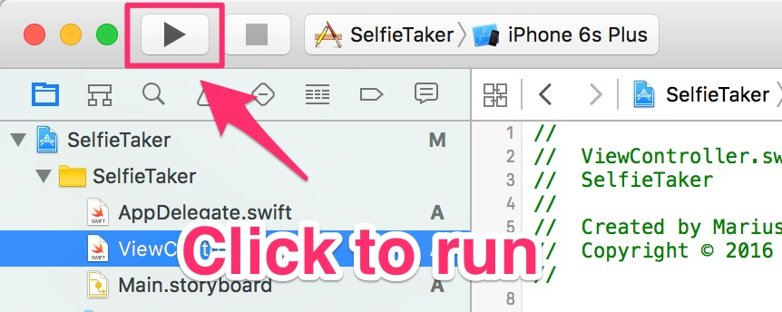

If your run starts and you can see empty iPhone screen - all went fine so far. 

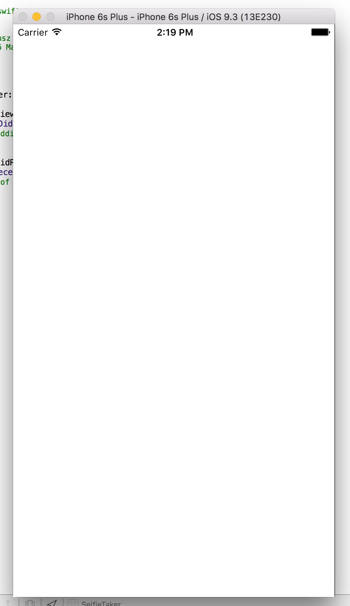

You just launched your first (?) iOS App. Now, lets make it do something useful!

## Add User Interface

First, we will add a top bar to our app, and prepare it to be able to navigate between screens. 

On the left menu, choose `Main.storyboard` file.

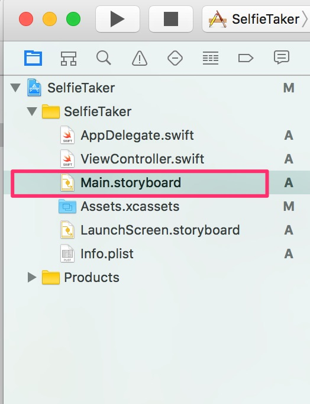

Doing so, will open UI Editor (Interface Builder). From there, find on the right side menu with UI elements and drag and drop to our storyboard element called `Navigation Controller`.

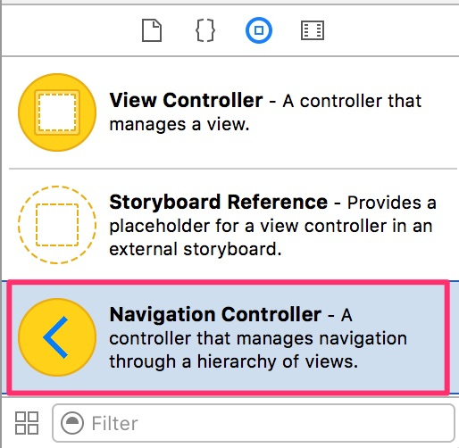

You will see two new controllers on your storyboard. From them, select the second one and remove it. 
Hold down `Control` button and drag and drop your mouse cursor from the the remaining `Navigation Controller View` to our original view.
From contextual menu that appears, select `rootViewController`.

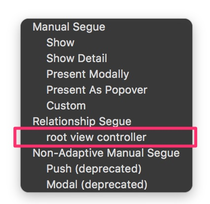

Select again navigation controller, and in options mark option `Is Initial View Controller`. This will tell XCode that it should be the initial screen showed to user when he launched the app.
Navigation Controller by itself doesn't define any UI elements - it's just a container for other view controllers. The root view controller we previously connected to it just means it will be the base view controller shown when app launches.

While in options, make sure to also select `Top Bar` style to be `Opaque Navigation Bar`. This will help us prevent photos being covered by the top bar.

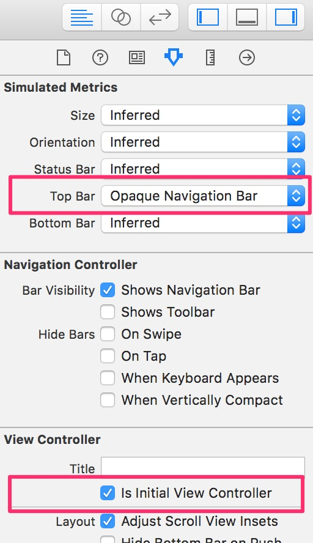 

Now we need to add some UI controllers to our main view. Drag and drop `Image View` on it. Make sure it fills the whole screen and set up proper constraints.
By setting constraints, we tell iOS how to size our view on different devices - right we just want our view to fill the whole screen, regardless of device size.

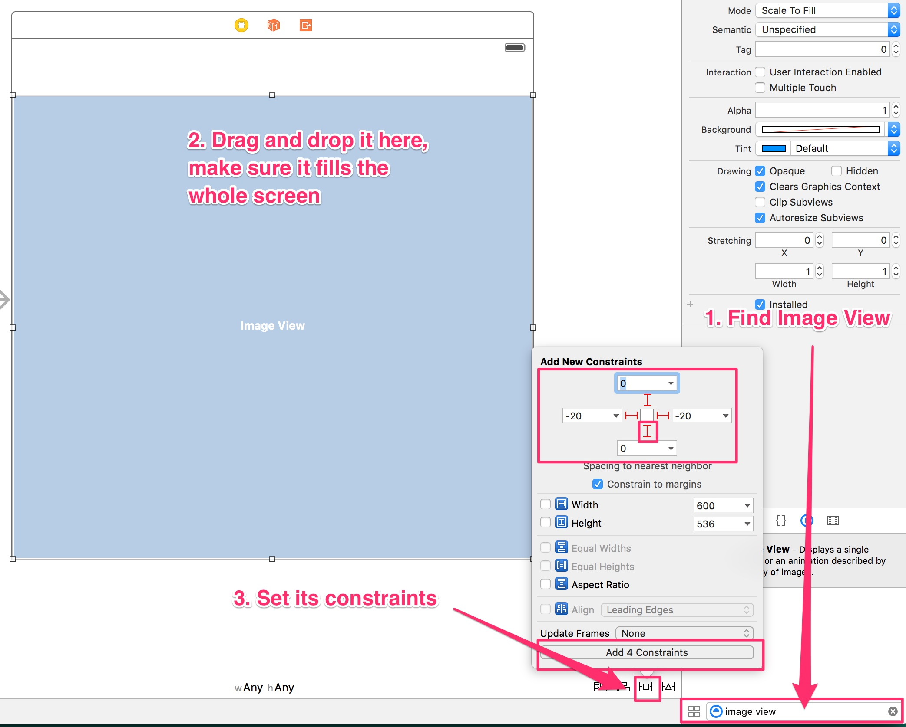

Change view mode in the right menu to `Aspect Fit` - this way we tell iOS how to display images in our view, if their ratio is different than the one of our screen. Feel free to play with it, and change between different settings later on, to see how it works.

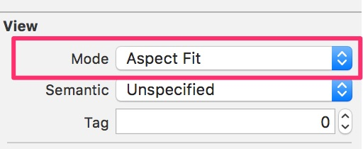

Add some button to our view. Find `Bar Button Item` element and drag them to our top bar.

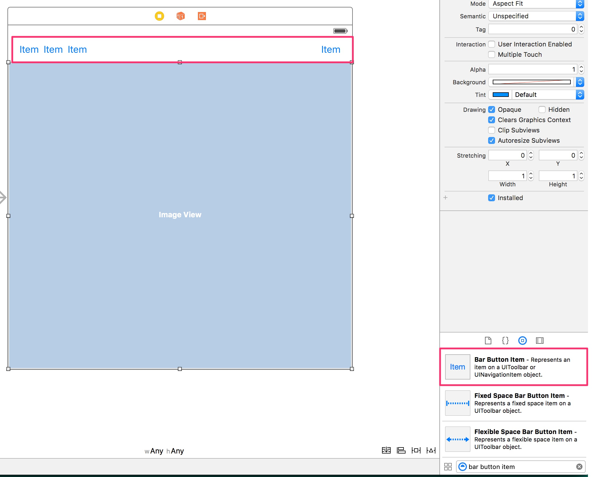

Now, change their names and/or icons. Click on each item on left menu and choose icons and names for them.
My settings for them were:

* System Icon - `Camera`
* System Icon - `Trash`
* Title - `Send`
* Title `All Selfies`

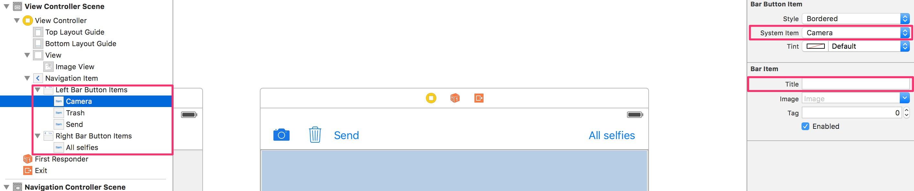

Open Assistant Editor mode - we will connect our newly added buttons to functions that will be called everytime buttons are pressed.

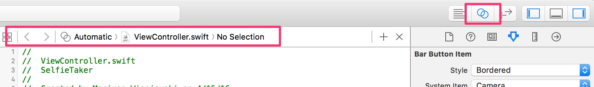

Make sure the code editor opened `ViewController.swift` file, as on the screen above.

Holding down control button, drag and drop our image view to the code section. On the assistant screen, choose 

* connectin - `Outlet`
* name - `imageView`
* type - `UIImageView`
* storage - `weak`

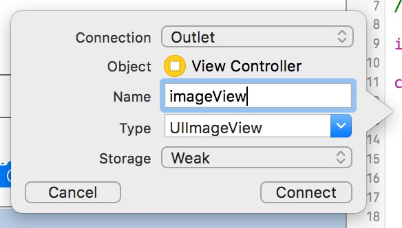

We just connected image view to our code - from now on, we will be able to manipulate it by coding. 

Now we need to do the same for our buttons. 

Hold down `control` button on your keyboard, click on each button item and try to drag and drop it to the code area, inside your class.
Menu will appear asking your to set up the connection between buttons and code.
Select `Action` connection type, for name type:

* `cameraPressed` (for 1st button)
* `trashPressed` (for 2nd button)
* `sendPressed` (for 3rd button)  
* `allSelfiesPressed` (for 4th button)

As type choose `UIBarButtonItem`

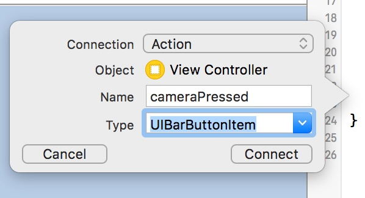

Ok, one last thing to add to our user interface. Add `Collection View Controller` to the storyboard. 
Holding down `control` button, drag and drop mouse cursor from `All Selfies` button to `Collection View Controller` and choose `Show`. By doing so, we tell XCode that we want to show this new controller, after `All Selfies` button is pressed.

Click on your `Collection view`, and in settings change its backround color to white.

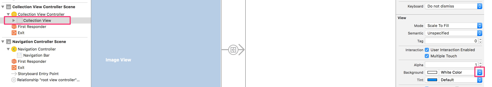

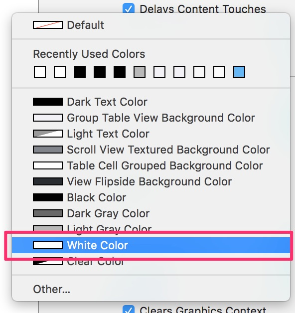

### Run!

Now you can run your project. You should see in iPhone Simulator (or on your phone) user interface looking exactly like we defined it, with buttons on the left not doing anything yet. If you press `All Selfies` it should take you to another empty screen, where later we will list all our selfies.

## Add some code

Finally time to do some real coding :)

Choose `ViewController.swift` from menu on the left, and hide Assistant Editor if you haven't done so yet.

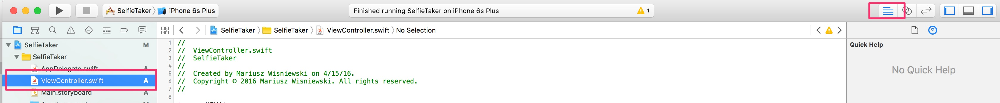

### Image Picker / Camera

Copy and paste this code, and replace your `cameraPressed` function with it.  

```swift
    @IBAction func cameraPressed(sender: AnyObject) {
        //UIImagePickerController is a system controller that allows browsing images or taking new ones
        let imagePicker = UIImagePickerController()
        
        //defines what is the source of images - device's photo album, or camera
        imagePicker.sourceType = .SavedPhotosAlbum
        if UIImagePickerController.isSourceTypeAvailable(.Camera) {
            imagePicker.sourceType = .Camera
            //camera can be either .Front or .Rear
            imagePicker.cameraDevice = .Front
            //do we want to capture photos or videos
            imagePicker.cameraCaptureMode = .Photo
        }
        //should we allow editing photos after they were taken
        imagePicker.allowsEditing = false
        //which class will be notified when image is taken. `self` means class you're currently in
        imagePicker.delegate = self
        //call this method to present any view controller on screen - here, we show the image picker
        self.presentViewController(imagePicker, animated: true, completion: nil);
    }
```

Comments in code should help to understand what the code does. In short - it creates an instance of `UIImagePickerController` object - it's a controller provided by iOS and it let you get images either from Saved Photos or from your device's camera.

What's important to know - iOS Simulator doesn't offer Camera as source of images - if you choose Camera and run your app in Simulator, it will crash. That's why we first ask what sources are available, and set it to Camera only if we run our app on device.

Add following code at the bottom of your `ViewController.swift` file.

```swift
// MARK: UIImagePickerControllerDelegate
// UIImagePickerControllerDelegate and UINavigationControllerDelegate are protocols - they define set of behaviors
// that your class can or have to implement (methods/functions in protocol can be either required or optional)
// in this class extension we put methods defined in UIImagePickerControllerDelegate protocol
extension ViewController : UIImagePickerControllerDelegate, UINavigationControllerDelegate {
    //this method will be called every time image picker controller finishes picking new image (from album or camera)
    func imagePickerController(picker: UIImagePickerController, didFinishPickingMediaWithInfo info: [String : AnyObject]) {
        //we get the original image
        if let pickedImage = info[UIImagePickerControllerOriginalImage] as? UIImage {
            //we add taken picture to our image -- and show it on screen doing so
            self.imageView.image = pickedImage
        }
        //we hide image picker controller (image was taken, we don't need it anymore)
        self.dismissViewControllerAnimated(true, completion: nil)
    }
    
    //called when user pressed cancel on image picker
    func imagePickerControllerDidCancel(picker: UIImagePickerController) {
        //if user pressed cancel, we want to hide image picker from the screen
        self.dismissViewControllerAnimated(true, completion: nil)
    }
}
```
Now, take this function and replace with it `trashPressed` method.

```swift
    @IBAction func trashPressed(sender: AnyObject) {
        //after user pressed trash icon, we want to remove picture from the view
        self.imageView.image = nil
    }
```

You can run you code now, and see how it works. You should be able to press on camera button, see list of photos stored on simulator (or if you run on device - you will be able to take a selfie!). After choosing one, it will hide the image picker and show your photo on the screen.

### Setting up Collection View - UI

Add collection view controller file to your project, by going to `File -> New -> File`.

Select `Cocoa Touch Class`.


Click `Next`, make sure `Language` is set to `Swift` and click `Next` again. Confirm default location for the file by clicking on `Create` button.

You will get new file, with bunch of code already in it - it will be useful!

Go back to your storyboard, as we need to do few more things in there.

Let XCode now, which class to use when connecting your view to code - in Class settings type `CollectionViewController`.

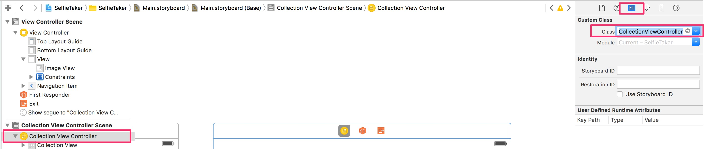

While in Storyboard, let's modify our UI a bit.

Click on `CollectionView` and change sizing setting, and make our selfie images bigger.

For cell size set width and height to `120`, and min spacing and insets to `3`.

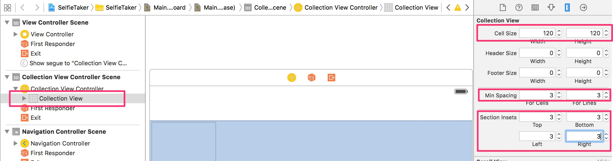

Drag and drop a new image view from UI elements into our collection view cell.

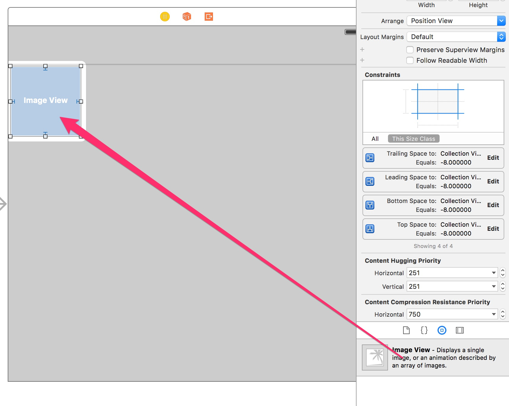

Click on the image view and set it constraints to `-8` from each side - it will make image view fill the cell (we use `-8` and not `0`, because we want to get rid of any margins - images will be spaced properly by collection view).

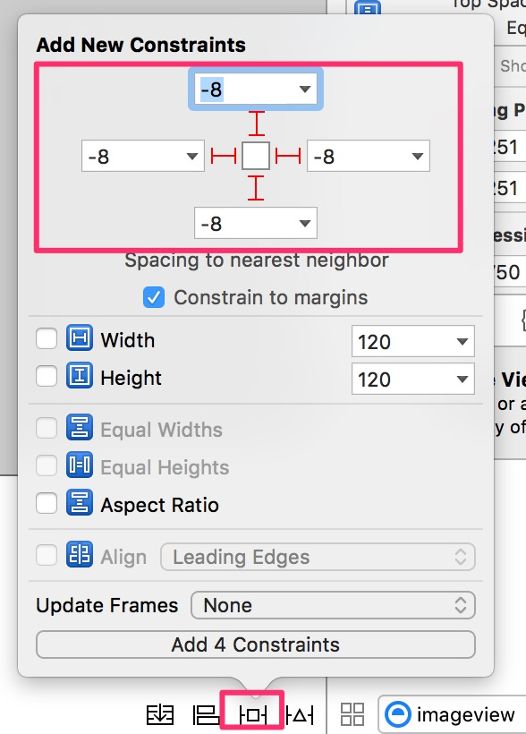

Change cell's image view settings to `Mode -> Aspect Fill` so our images can take up the whole cell space.

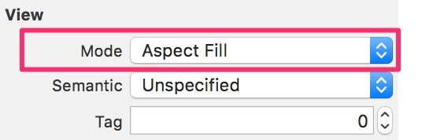

Go into assistant editor again - we will need to connect this image view to our cell in code.


Paste following code on top of the file, to define an empty cell class.

```swift
class CollectionViewCell : UICollectionViewCell {
    
}
```

Similar as we did for collection view class, click on collection view cell and set its class to `CollectionViewCell` (the one we defined above).

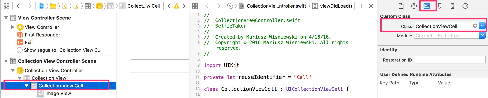

Still in settings, set cell `Identifier` to `Cell`.

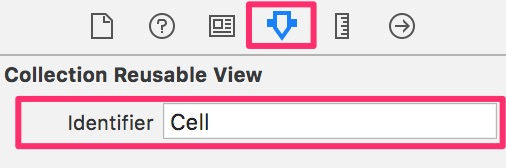
 
Now, exactly as before, hold down `control` button and drag and drop from the image view, to our cell in code.
Create an `Outlet` connection and name it `imageView`.

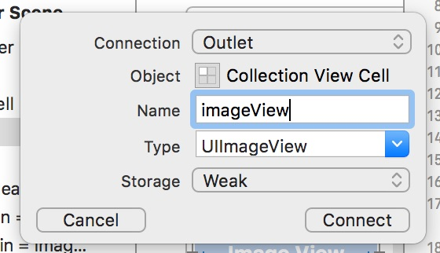

### Setting up Collection View - coding

Choose `CollectionViewController.swift` from the left menu and get back to coding!

Find `viewDidLoad` method and remove from it following line of code:

```swift
self.collectionView!.registerClass(UICollectionViewCell.self, forCellWithReuseIdentifier: reuseIdentifier)
```

Because we already set up our cell in Interface Builder, we don't need to do it in code (actually doing so, would make our app crash, if we would like to use our image view).

Add two more classes on top of your file.

```swift
//utility class
class Utilities {
    class func getDeviceIdentifier() -> String {
        return UIDevice.currentDevice().identifierForVendor!.UUIDString
    }
}
```

This is a simple utility class, that will help us get device unique identifier - we won't use it now, but will be useful for later.

Second class will define our photos.

```swift
//class defining our Photo class
class Photo {
    var name = ""
    var deviceId = ""
    var image : UIImage?
    
    //custom init method - useful for quick creation of new objects of this class
    init(name: String, image: UIImage?) {
        self.name = name;
        self.image = image
        self.deviceId = Utilities.getDeviceIdentifier()
    }
}
```

We define some properties on our class, like name of the photo and underlying image. We also add `init` method that will allow us to easily create new objects of this class.

Inside `CollectionViewController` class, add this line on top.

```swift
var photos : [Photo] = []
```

It defines source of our photos displayed inside collection view - we want to display photos, so we need a photos array. Because we want to modify this list during app lifetime, we define it as `var` (variable) and not `let` (constant).

Find function `numberOfSectionsInCollectionView` and and change it's content to `return 1`.

```swift
override func numberOfSectionsInCollectionView(collectionView: UICollectionView) -> Int {
    return 1
}
```

It lets iOS know, that we will have only one section of photos - our list will not be split into different sections with photos of different kind.

Find `func collectionView(collectionView: UICollectionView, numberOfItemsInSection section: Int) -> Int` function and change its content to `return self.photos.count`.

```swift
override func collectionView(collectionView: UICollectionView, numberOfItemsInSection section: Int) -> Int {
    return self.photos.count
}
```  

This time we tell iOS how many photos we want to display in a section. Because we have only one section, we want to display all photos -- so we return number of photos stored in our array.

Last step here - find `override func collectionView(collectionView: UICollectionView, cellForItemAtIndexPath indexPath: NSIndexPath)` function and change its content to:

```swift
    override func collectionView(collectionView: UICollectionView, cellForItemAtIndexPath indexPath: NSIndexPath) -> UICollectionViewCell {
        //get the cell that should be displayed
        let cell = collectionView.dequeueReusableCellWithReuseIdentifier(reuseIdentifier, forIndexPath: indexPath)
        
        //cast the cell to our cell class type - CollectionViewCell
        if let cell = cell as? CollectionViewCell {
            //make the cell display our image
            cell.imageView.image = self.photos[indexPath.row].image
        }
        
        //return configured cell
        return cell
    }
```

We configure here the cell we want to display. We get a reusable cell from collection view. To save memory, system provides us with this method -- if the cell doesn't exist yet, it created a new one and returns it. If it has a cell that exists but is not used -- it gives it back, so we can reuse it.

Next, we let system know, that class of our cell is `CollectionViewCell` (so we can use image view we added) and we set the image to the one stored in our Photo object. 

Run your app, click on everything and test we didn't break anything ;) Other than not breaking anything, it should work exactly as before.

### Passing photos to collection view

Go back to `ViewController.swift` file. Inside `ViewController` class, add one more function:

```swift
    //this method is called, before transition defined in storyboard is performed
    override func prepareForSegue(segue: UIStoryboardSegue, sender: AnyObject?) {
        //we check the name of the transition
        if let collectionViewController = segue.destinationViewController as? CollectionViewController {
            //we add a photo to the next view controller
            collectionViewController.photos = [Photo(name: "name", image: self.imageView.image)]
        }
    }
```

This method is being call by iOS everytime new transition is being made from one view to another. We set up that kind of transition before - pressing on `All Selfies` button, goes to `Collection View Controller`. The only thing we need to do here, is to pass the only photo we have to it.

Run your project now, click on Camera button, select one photo, and now click on `All Selfies` - you will see a list, with only one element - image you selected before. That's it, your app is finished! Now you can take selfies anywhere, in case you don't have Snapchat yet ;)

# Add Syncano To Selfie Taker App!

Time for another big step - sending your photos to Syncano and storing them in there, so you can easily retrieve them later. 

## Install Syncano with CocoaPods

If you don't know what CocoaPods are yet -- it's a package manager often used by iOS developers, to add and install frameworks and libraries made by other developers, easily extending what your app can do.

This is the recommened way of installing Syncano and adding it to your app.

If you don't have CocoaPods yet (or you don't know if you have it), open your Terminal app and type in there

```bash
sudo gem install cocoapods
```

If you didn't have CocoaPods installed before, please make sure to close Terminal window and open a new one before proceeding to the next step - otherwise `pod` command might not be recognized when you try to use it. 

Navigate in Terminal to project's folder, by typing

```bash
cd /path/to/your/app
```
(where `/path/to/your/app` is e.g. `~/MyApps/SelfieTaker/`, if your app is located in `MyApp` in your home directory -- it has to be the same folder your `.xcodeproj` is in)

Type

```bash
pod init
```

After a few seconds, you will see `Podfile` added. Edit it with any text editor you want.

Inside, add a two lines of text:

```ruby
pod pod 'syncano-ios'
pod 'SDWebImage', '~>3.7' 
```

and uncomment the line with `use_frameworks!`. After changes, your `Podfile` should look more less like this:

```ruby
# Uncomment this line to define a global platform for your project
# platform :ios, '8.0'
# Uncomment this line if you're using Swift
use_frameworks!

target 'SelfieTaker' do
pod 'syncano-ios'
pod 'SDWebImage', '~>3.7'
end
```

First line we added, will let you install Syncano. Second one, adds `SDWebImage` framework, which we will use for image caching -- so we won't have to download same image multiple times (if it was already downloaded once).

Now, you can install added pods. Type in Terminal app 

```bash
pod install
```

Close your XCode project, and open newly created workspace file. In my case it's `SelfieTaker.xcworkspace`

```bash
open SelfieTaker.xcworkspace
```

Run your project to compile and build new libraries and make sure it works as before.

## Coding - send photos to Syncano

### Add new UI to ViewController

Let's start from adding some UI in code. Add this code inside your `ViewController` class.

```swift
//define activity indicator and initialize it
let activityIndicator = UIActivityIndicatorView(activityIndicatorStyle: .WhiteLarge)
``` 

We will be using this activity indicator to show to our users that a photo is being uploaded. Inside your `viewDidLoad` method add few calls to set up where it will be located and how will it look like.

```
//set up activity indicator properties - color, behavior etc.
self.activityIndicator.color = UIColor.blackColor()
self.activityIndicator.hidesWhenStopped = true
self.navigationItem.titleView = activityIndicator
```

We first set its color to black, indicate that it should be hidden when it's not animating and we add it to title view of our top navigation bar.

### Set up Syncano connection

Now, open `AppDelegate.swift` file to set up Syncano connection in there for the whole app.

Add on top of your file 

```swift
import syncano_ios
```

and inside `func application(application: UIApplication, didFinishLaunchingWithOptions launchOptions: [NSObject: AnyObject]?) -> Bool` function add

```swift
Syncano.sharedInstanceWithApiKey("3b22dd534bbdc6920b41c401a1bca837cdb98f8f", instanceName: "diamond-hack")
```

(if you use this instance -- remember everyone will have access to these photos, so be careful about what you upload ;))

ideally this should your Instance name and your API Key, but for simplicity -- you can use mine for now :)

After these changes top of your `AppDelegate.swift` file should look like this:

```swift
import UIKit
import syncano_ios

@UIApplicationMain
class AppDelegate: UIResponder, UIApplicationDelegate {

    var window: UIWindow?


    func application(application: UIApplication, didFinishLaunchingWithOptions launchOptions: [NSObject: AnyObject]?) -> Bool {
        // Override point for customization after application launch.
        Syncano.sharedInstanceWithApiKey("3b22dd534bbdc6920b41c401a1bca837cdb98f8f", instanceName: "diamond-hack")
        return true
    }
```

### Display images from Syncano

Now go to `CollectionViewController.swift` file and change our `Photo` class to indicate it's a class that will be connected to Syncano.

Add on top of your file `import syncano_ios`, `import SDWebImage` (for image caching) and change code defining your `Photo` class to

```swift
class Photo : SCDataObject {
    var name = ""
    var deviceId = ""
    var image : SCFile?
    var downloadedImage : UIImage?
    
    //custom init method - useful for quick creation of new objects of this type
    init(name: String, image: UIImage?) {
        self.name = name
        if image != nil {
            let data = UIImageJPEGRepresentation(image!, 0.5)
            self.image = SCFile(aData: data)
        }
        self.deviceId = Utilities.getDeviceIdentifier()
        super.init()
    }
    
    required init(dictionary dictionaryValue: [NSObject : AnyObject]!) throws {
        try super.init(dictionary: dictionaryValue)
    }
    
    required init!(coder: NSCoder!) {
        super.init(coder: coder)
    }
    
    override init() {
        super.init()
    }
}
```

What's important to notice here is that we change the class of `image` variable - from `UIImage` to `SCFile` - this way we indicate it's an image file stored on Syncano, not locally.
We have a new variable called `downloadedImage` - we will use it to store images after they were already downloaded.

We also change init method to compensate for that, and we added a few extra methods, to stop app from crashing :)

Find `func collectionView(collectionView: UICollectionView, cellForItemAtIndexPath indexPath: NSIndexPath) -> UICollectionViewCell` and change it to:

```swift
    override func collectionView(collectionView: UICollectionView, cellForItemAtIndexPath indexPath: NSIndexPath) -> UICollectionViewCell {
        //get the cell that should be displayed
        let cell = collectionView.dequeueReusableCellWithReuseIdentifier(reuseIdentifier, forIndexPath: indexPath)
        
        //cast the cell to our cell class type - CollectionViewCell
        if let cell = cell as? CollectionViewCell {
            //get current photo
            let photo = self.photos[indexPath.row]
            
            //check if we already downloaded current photo
            if let data = photo.image?.data {
                //if yes, we stop loading animation and we set the image on the cell view
                cell.activityIndicator.stopAnimating()
                cell.imageView.image = UIImage(data: data)
            } else if photo.image != nil {
                //start loading animation, so user knows what's going on
                cell.activityIndicator.startAnimating()
                
                //we added Pod module that helps with caching - lets use it!
                //download image for give URL - it will be cached automatically
                cell.imageView.sd_setImageWithURL(photo.image?.fileURL, completed: { image, error, cacheType, url in
                    
                    //when image is downloaded, or taken from cache - stop the animation
                    cell.activityIndicator.stopAnimating()
                    
                    //set the image on cell
                    cell.imageView.image = image
                    
                    //save downloaded image
                    photo.downloadedImage = image
                })
            }
        }
        //return configured cell
        return cell
    }
```

Base idea is the same as before - get the reusable cell and configure it. What is new is the configuration part - we now instead of taking the stored image, download it from the internet. If it was already downloaded and is cached on disk - it will be taken from disk for us automatically.

You probably noticed you have some errors highlighted in XCode - it's because we haven't defined activity indicator on collection view cell yet.

Before we fix it, add some UI to indicate downloading images list from Syncano. Put this code on top of your class implementation (same thing we did in `ViewController` class)

```swift
let activityIndicator = UIActivityIndicatorView(activityIndicatorStyle: .WhiteLarge)
``` 

and add this at the bottom of `viewDidLoad` method

```swift
self.activityIndicator.color = UIColor.blackColor()
self.activityIndicator.hidesWhenStopped = true
self.navigationItem.titleView = activityIndicator
``` 

### Download images from Syncano

Add this function to your class, to be able to download images from Syncano.

```swift
//method used to download images from Syncano
    func reloadImagesFromSyncano() {
        
        //before we start downloading images, start loading indicator
        self.activityIndicator.startAnimating()
        
        //ask for photos from Syncano
        //every SCDataObject class (and subclasses) offers please() method - always use it to download objects
        //if you want to filter your objects, use please().giveMeDataObjectsWithPredicate
        //and SCPredicate.whereKey -- to define search criteria
        Photo.please().giveMeDataObjectsWithPredicate(SCPredicate.whereKey("deviceId", isEqualToString: Utilities.getDeviceIdentifier()), parameters: nil) { photos, error in
            
            //after photos were downlaoded, stop loading indicator
            self.activityIndicator.stopAnimating()
            
            //save downloaded photos list to memory
            if let photos = photos as? [Photo] {
                self.photos = photos
            }
            
            //reload our view with newly downloaded images
            self.collectionView?.reloadData()
        }
    }
```

At the beginning we start animating the activity indicator, and when downloading is finished - we stop it (and it will hide automatically).

Main part of downloading images from Syncano is done here

```swift
Photo.please().giveMeDataObjectsWithPredicate(SCPredicate.whereKey("deviceId", isEqualToString: Utilities.getDeviceIdentifier()), parameters: nil) { photos, error in
```

Here you say you want to download Photo objects from Syncano. Using `SCPredicate` we ask to get only images with our own `deviceId` -- so we don't see images of other people. You can experiment with it later and change it to call

```swift
Photo.please().giveMeDataObjectsWithCompletion { photos, error in
```

so you will see all images -- if you want to see what other people were sending :)

When images are downloaded, we assign them to photos array, stop activity indicator and refresh the collection view.

Now we just need to call this function from somewhere. Add this code to your class

```swift
    //called before this view appears on the screen
    override func viewWillAppear(animated: Bool) {
        super.viewWillAppear(animated)
        //reload data before view is displayed
        self.reloadImagesFromSyncano()
    }
```

`viewWillAppear` function is called by iOS before view appears on screen (obvious) - we use this moment to start downloading images from Syncano.

### Add Delegate Protocol

Before we leave this class, there's only few more things left to be added. Your app can now download images from Syncano and display them on a list. What we would like to do as well, is to see these images in full screen, after they were selected. To do so, add this on top of your file

```swift
protocol SelectedPhotoDelegate {
    func userDidSelectPhoto(photo: UIImage)
}
```

Protocol is a way to describe set of methods that can be called on an object. In here, our class defines a protocol -- it will want to communicate to a delegate moment when user selects a photo -- but it will be up to this `delegate` object to decide what to do with this information.

Add somewhere inside `CollectionViewController` class a new delegate variable

```swift
var delegate : SelectedPhotoDelegate?
```

It's an optional - meaning this variable might have or not have a value. Our app should run ok without a delegate -- it will just mean, that no action will be taken after photo was selected.

Add a method that will be called everytime user taps on an image

```swift
    //add function that will be called when image was selected
    override func collectionView(collectionView: UICollectionView, didSelectItemAtIndexPath indexPath: NSIndexPath) {
        //get selected photo
        let photo = self.photos[indexPath.row]
        
        //if there is an image (already downloaded) pass it to delegate
        if let image = photo.downloadedImage {
            self.delegate?.userDidSelectPhoto(image)
        }
    }
```

Now we're ready to fix the error with the activity indicator in a cell

### Add Activity Indicator to a cell

Go back to your storyboard file. Find `Activity Indicator` UI element, and drag and drop it to the middle of your cell. Set it's style to `Large White` and color `Black` so it's more visible. Make sure to also select `Hides When Stopped`.

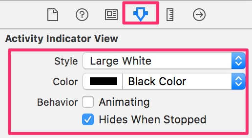

You should know by now how to make an outlet connection. If you don't remember:

* open Assistant Editor
* hold down `control` key, and drag and drop from an activity indicator to your `CollectionViewCell` class in code editor
* set up an outlet connection

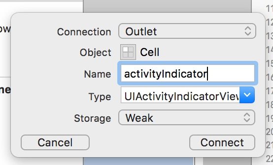

Run your project and make sure you don't see any errors anymore.

Ok, so you are now downloading images from Syncano - problem is there are none in there yet. We need to start sending something!

## Send Images to Syncano

Go to `ViewController.swift` file. You may remember we have in there an empty function called `sendPressed`. So far it does nothing - we will change it and make it save our image in Syncano.

Find `sendPressed` function and change it to

```swift
    //method to send current selfie image to Syncano
    @IBAction func sendPressed(button: UIBarButtonItem) {
        //if there is not image, return - we don't want to send empty images
        guard let image = self.imageView.image else {
            return
        }
        let photo = Photo(name: "\(NSDate())", image: image)
        self.activityIndicator.startAnimating()
        button.enabled = false
        photo.saveWithCompletionBlock { error in
            self.activityIndicator.stopAnimating()
            button.enabled = true
            if error != nil {
                print("Error saving image: \(error)");
            }
        }
    }
```

First, using `guard` statement, we check if there is any image displayed currently. If not, function returns - so we don't make a connection to Syncano trying to send a non-existing image.

Then, we create a new Photo object, set its name to current date, and as image - image that's currently displayed on the screen.
Next we start an activity indicator, disable `Send` button and we save our Photo.
When `save` is finished, our image is stored on Syncano, so we can stop the activity indicator and enable again the `Send` button. 

That's almost all. Before we can run our project again, find `prepareForSegue` function we added before and change it to

```swift
//this method is called, before transition defined in storyboard is performed
    override func prepareForSegue(segue: UIStoryboardSegue, sender: AnyObject?) {
        //we check the name of the transition
        if let collectionViewController = segue.destinationViewController as? CollectionViewController {
            //we add a photo to the next view controller
            collectionViewController.delegate = self
        }
    }
```

We don't need to pass any picture anymore, but we need to set ourselves as collection view controller delegate -- so we will know when user presses on a picture to display it on a full screen.

Add delegate protocol implementation at the bottom of your `ViewController.swift` file

```swift
// MARK: SelectedPhotoDelegate
// implementation of protocol - define what happens when user selects a photo
extension ViewController : SelectedPhotoDelegate {
    func userDidSelectPhoto(photo: UIImage) {
        self.imageView.image = photo
        self.navigationController?.popToRootViewControllerAnimated(true)
    }
}
```
