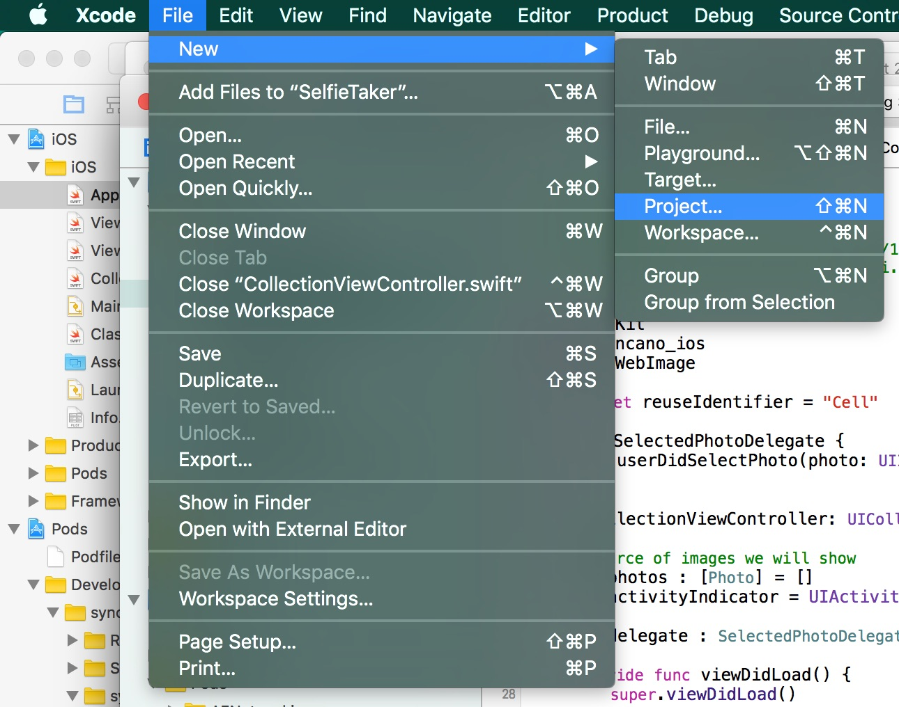

# How to create a Selfie Taker iOS app with Syncano

## Create a new XCode project

Start from creating a new empty XCode project. Open XCode, and from file menu select `File -> New -> Project`



Choose `Single View Application` and type product name (e.g. `SelfieTaker`). Make sure app language is set to `Swift` and click `Next`. Select a folder where your project should be created and and confirm with `Create` button.

Run your app, either by using run button, or by key Command-R key combination.


If your run starts and you can see empty iPhone screen - all went fine so far. 


You just launched your first (?) iOS App. Now, lets make it do something useful!

## Add User Interface

First, we will add a top bar to our app, and prepare it to be able to navigate between screens. 

On the left menu, choose `Main.storyboard` file.


Doing so, will open UI Editor (Interface Builder). From there, find on the right side menu with UI elements and drag and drop to our storyboard element called `Navigation Controller`.


You will see two new controllers on your storyboard. From them, select the second one and remove it. 
Hold down `Control` button and drag and drop your mouse cursor from the the remaining `Navigation Controller View` to our original view.
From contextual menu that appears, select `rootViewController`.


Select again navigation controller, and in options mark option `Is Initial View Controller`. This will tell XCode that it should be the initial screen showed to user when he launched the app.
Navigation Controller by itself doesn't define any UI elements - it's just a container for other view controllers. The root view controller we previously connected to it just means it will be the base view controller shown when app launches.

While in options, make sure to also select `Top Bar` style to be `Opaque Navigation Bar`. This will help us prevent photos being covered by the top bar.

 

Now we need to add some UI controllers to our main view. Drag and drop `Image View` on it. Make sure it fills the whole screen and set up proper constraints.
By setting constraints, we tell iOS how to size our view on different devices - right we just want our view to fill the whole screen, regardless of device size.


Change view mode in the right menu to `Aspect Fit` - this way we tell iOS how to display images in our view, if their ratio is different than the one of our screen. Feel free to play with it, and change between different settings later on, to see how it works.


Add some button to our view. Find `Bar Button Item` element and drag them to our top bar.


Now, change their names and/or icons. Click on each item on left menu and choose icons and names for them.
My settings for them were:

* System Icon - `Camera`
* System Icon - `Trash`
* Title - `Send`
* Title `All Selfies`


Open Assistant Editor mode - we will connect our newly added buttons to functions that will be called everytime buttons are pressed.


Make sure the code editor opened `ViewController.swift` file, as on the screen above.

Holding down control button, drag and drop our image view to the code section. On the assistant screen, choose 

* connectin - `Outlet`
* name - `imageView`
* type - `UIImageView`
* storage - `weak`


We just connected image view to our code - from now on, we will be able to manipulate it by coding. 

Now we need to do the same for our buttons. 

Hold down `control` button on your keyboard, click on each button item and try to drag and drop it to the code area, inside your class.
Menu will appear asking your to set up the connection between buttons and code.
Select `Action` connection type, for name type:

* `cameraPressed` (for 1st button)
* `trashPressed` (for 2nd button)
* `sendPressed` (for 3rd button)  
* `allSelfiesPressed` (for 4th button)

As type choose `UIBarButtonItem`


Ok, one last thing to add to our user interface. Add `Collection View Controller` to the storyboard. 
Holding down `control` button, drag and drop mouse cursor from `All Selfies` button to `Collection View Controller` and choose `Show`. By doing so, we tell XCode that we want to show this new controller, after `All Selfies` button is pressed.

Click on your `Collection view`, and in settings change its backround color to white.


### Run!

Now you can run your project. You should see in iPhone Simulator (or on your phone) user interface looking exactly like we defined it, with buttons on the left not doing anything yet. If you press `All Selfies` it should take you to another empty screen, where later we will list all our selfies.

## Add some code

Finally time to do some real coding :)

Choose `ViewController.swift` from menu on the left, and hide Assistant Editor if you haven't done so yet.


### Image Picker / Camera

Copy and paste this code, and replace your `cameraPressed` function with it.  

```swift
    @IBAction func cameraPressed(sender: AnyObject) {
        //UIImagePickerController is a system controller that allows browsing images or taking new ones
        let imagePicker = UIImagePickerController()
        
        //defines what is the source of images - device's photo album, or camera
        imagePicker.sourceType = .SavedPhotosAlbum
        if UIImagePickerController.isSourceTypeAvailable(.Camera) {
            imagePicker.sourceType = .Camera
            //camera can be either .Front or .Rear
            imagePicker.cameraDevice = .Front
            //do we want to capture photos or videos
            imagePicker.cameraCaptureMode = .Photo
        }
        //should we allow editing photos after they were taken
        imagePicker.allowsEditing = false
        //which class will be notified when image is taken. `self` means class you're currently in
        imagePicker.delegate = self
        //call this method to present any view controller on screen - here, we show the image picker
        self.presentViewController(imagePicker, animated: true, completion: nil);
    }
```

Comments in code should help to understand what the code does. In short - it creates an instance of `UIImagePickerController` object - it's a controller provided by iOS and it let you get images either from Saved Photos or from your device's camera.

What's important to know - iOS Simulator doesn't offer Camera as source of images - if you choose Camera and run your app in Simulator, it will crash. That's why we first ask what sources are available, and set it to Camera only if we run our app on device.

Add following code at the bottom of your `ViewController.swift` file.

```swift
// MARK: UIImagePickerControllerDelegate
// UIImagePickerControllerDelegate and UINavigationControllerDelegate are protocols - they define set of behaviors
// that your class can or have to implement (methods/functions in protocol can be either required or optional)
// in this class extension we put methods defined in UIImagePickerControllerDelegate protocol
extension ViewController : UIImagePickerControllerDelegate, UINavigationControllerDelegate {
    //this method will be called every time image picker controller finishes picking new image (from album or camera)
    func imagePickerController(picker: UIImagePickerController, didFinishPickingMediaWithInfo info: [String : AnyObject]) {
        //we get the original image
        if let pickedImage = info[UIImagePickerControllerOriginalImage] as? UIImage {
            //we add taken picture to our image -- and show it on screen doing so
            self.imageView.image = pickedImage
        }
        //we hide image picker controller (image was taken, we don't need it anymore)
        self.dismissViewControllerAnimated(true, completion: nil)
    }
    
    //called when user pressed cancel on image picker
    func imagePickerControllerDidCancel(picker: UIImagePickerController) {
        //if user pressed cancel, we want to hide image picker from the screen
        self.dismissViewControllerAnimated(true, completion: nil)
    }
}
```
Now, take this function and replace with it `trashPressed` method.

```swift
    @IBAction func trashPressed(sender: AnyObject) {
        //after user pressed trash icon, we want to remove picture from the view
        self.imageView.image = nil
    }
```

You can run you code now, and see how it works. You should be able to press on camera button, see list of photos stored on simulator (or if you run on device - you will be able to take a selfie!). After choosing one, it will hide the image picker and show your photo on the screen.

### Setting up Collection View - UI

Add collection view controller file to your project, by going to `File -> New -> File`.

Select `Cocoa Touch Class`.


Click `Next`, make sure `Language` is set to `Swift` and click `Next` again. Confirm default location for the file by clicking on `Create` button.

You will get new file, with bunch of code already in it - it will be useful!

Go back to your storyboard, as we need to do few more things in there.

Let XCode now, which class to use when connecting your view to code - in Class settings type `CollectionViewController`.


While in Storyboard, let's modify our UI a bit.

Click on `CollectionView` and change sizing setting, and make our selfie images bigger.

For cell size set width and height to `120`, and min spacing and insets to `3`.


Drag and drop a new image view from UI elements into our collection view cell.


Click on the image view and set it constraints to `-8` from each side - it will make image view fill the cell (we use `-8` and not `0`, because we want to get rid of any margins - images will be spaced properly by collection view).


Change cell's image view settings to `Mode -> Aspect Fill` so our images can take up the whole cell space.


Go into assistant editor again - we will need to connect this image view to our cell in code.


Paste following code on top of the file, to define an empty cell class.

```swift
class CollectionViewCell : UICollectionViewCell {
    
}
```

Similar as we did for collection view class, click on collection view cell and set its class to `CollectionViewCell` (the one we defined above).


Still in settings, set cell `Identifier` to `Cell`.


 
Now, exactly as before, hold down `control` button and drag and drop from the image view, to our cell in code.
Create an `Outlet` connection and name it `imageView`.


### Setting up Collection View - coding

Choose `CollectionViewController.swift` from the left menu and get back to coding!

Find `viewDidLoad` method and remove from it following line of code:

```swift
self.collectionView!.registerClass(UICollectionViewCell.self, forCellWithReuseIdentifier: reuseIdentifier)
```

Because we already set up our cell in Interface Builder, we don't need to do it in code (actually doing so, would make our app crash, if we would like to use our image view).

Add two more classes on top of your file.

```swift
//utility class
class Utilities {
    class func getDeviceIdentifier() -> String {
        return UIDevice.currentDevice().identifierForVendor!.UUIDString
    }
}
```

This is a simple utility class, that will help us get device unique identifier - we won't use it now, but will be useful for later.

Second class will define our photos.

```swift
//class defining our Photo class
class Photo {
    var name = ""
    var deviceId = ""
    var image : UIImage?
    
    //custom init method - useful for quick creation of new objects of this class
    init(name: String, image: UIImage?) {
        self.name = name;
        self.image = image
        self.deviceId = Utilities.getDeviceIdentifier()
    }
}
```

We define some properties on our class, like name of the photo and underlying image. We also add `init` method that will allow us to easily create new objects of this class.

Inside `CollectionViewController` class, add this line on top.

```swift
var photos : [Photo] = []
```

It defines source of our photos displayed inside collection view - we want to display photos, so we need a photos array. Because we want to modify this list during app lifetime, we define it as `var` (variable) and not `let` (constant).

Find function `numberOfSectionsInCollectionView` and and change it's content to `return 1`.

```swift
override func numberOfSectionsInCollectionView(collectionView: UICollectionView) -> Int {
    return 1
}
```

It lets iOS know, that we will have only one section of photos - our list will not be split into different sections with photos of different kind.

Find `func collectionView(collectionView: UICollectionView, numberOfItemsInSection section: Int) -> Int` function and change its content to `return self.photos.count`.

```swift
override func collectionView(collectionView: UICollectionView, numberOfItemsInSection section: Int) -> Int {
    return self.photos.count
}
```  

This time we tell iOS how many photos we want to display in a section. Because we have only one section, we want to display all photos -- so we return number of photos stored in our array.

Last step here - find `override func collectionView(collectionView: UICollectionView, cellForItemAtIndexPath indexPath: NSIndexPath)` function and change its content to:

```swift
    override func collectionView(collectionView: UICollectionView, cellForItemAtIndexPath indexPath: NSIndexPath) -> UICollectionViewCell {
        //get the cell that should be displayed
        let cell = collectionView.dequeueReusableCellWithReuseIdentifier(reuseIdentifier, forIndexPath: indexPath)
        
        //cast the cell to our cell class type - CollectionViewCell
        if let cell = cell as? CollectionViewCell {
            //make the cell display our image
            cell.imageView.image = self.photos[indexPath.row].image
        }
        
        //return configured cell
        return cell
    }
```

We configure here the cell we want to display. We get a reusable cell from collection view. To save memory, system provides us with this method -- if the cell doesn't exist yet, it created a new one and returns it. If it has a cell that exists but is not used -- it gives it back, so we can reuse it.

Next, we let system know, that class of our cell is `CollectionViewCell` (so we can use image view we added) and we set the image to the one stored in our Photo object. 

Run your app, click on everything and test we didn't break anything ;) Other than not breaking anything, it should work exactly as before.

### Passing photos to collection view

Go back to `ViewController.swift` file. Inside `ViewController` class, add one more function:

```swift
    //this method is called, before transition defined in storyboard is performed
    override func prepareForSegue(segue: UIStoryboardSegue, sender: AnyObject?) {
        //we check the name of the transition
        if let collectionViewController = segue.destinationViewController as? CollectionViewController {
            //we add a photo to the next view controller
            collectionViewController.photos = [Photo(name: "name", image: self.imageView.image)]
        }
    }
```

This method is being call by iOS everytime new transition is being made from one view to another. We set up that kind of transition before - pressing on `All Selfies` button, goes to `Collection View Controller`. The only thing we need to do here, is to pass the only photo we have to it.

Run your project now, click on Camera button, select one photo, and now click on `All Selfies` - you will see a list, with only one element - image you selected before. That's it, your app is finished! Now you can take selfies anywhere, in case you don't have Snapchat yet ;)
